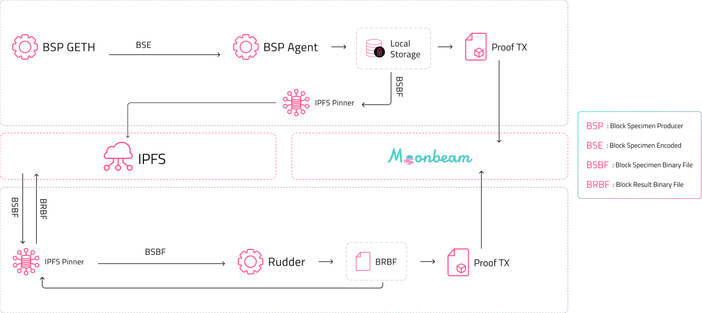

[](https://www.covalenthq.com/static/documents/Block%20Specimen%20Whitepaper%20V1.2.pdf)

<div align="center">
  <a href="https://github.com/covalenthq/rudder/releases/latest">
    
  </a>
  <a href="https://github.com/covalenthq/rudder/blob/main/LICENSE">
    
  </a>
  <a href="http://covalenthq.com/discord">
    
  </a>
    <a href="http://covalenthq.com/discord">
    
  </a>
</div>
<div align="center">
  <a href="https://github.com/covalenthq/rudder/actions/workflows/compile-format.yaml?query=branch%3Amain+workflow%3Acompile-format">
    
  </a>
  <a href="https://github.com/covalenthq/rudder/actions/workflows/docker-ci-test.yaml?query=branch%3Amain+workflow%3Adocker-ci-test">
    
  </a>
  <a href="https://github.com/covalenthq/rudder/actions/workflows/hadolint.ymlquery=branch%3Amain+workflow%3Ahadolint">
    
  </a>
  <a href="https://twitter.com/@Covalent_HQ">
    
  </a>
</div>

# Rudder

- [Introduction](#introduction)
  - [Raison d'être](#raison-dêtre)
- [Architecture](#architecture)
- [Resources](#resources)
  - [Additional Resources](#additional-resources)
- [Requirements](#requirements)
- [Run with Docker Compose](#run-with-docker-compose)
  - [Environment](#environment)
  - [Pull](#pull)
  - [Run](#docker-run)
  - [Monitor](#monitor)
- [Build & Run From Source](#build-from-source)
  - [Linux x86_64](#linux-x86_64-ubuntu-2204-lts-install-dependencies)
  - [Environment](#env-vars)
  - [Run](#source-run)
  - [Monitor](#monitor)
- [Troubleshooting](#troubleshooting)
  - [Bugs Reporting & Contributions](#bugs-reporting-contributions)
- [Scripts](#scripts)

## <span id="rudder_intro">Introduction</span>

The Refiner is a block specimen data processing and transformation framework (Rudder), the purpose of which is validated data transformation.

Generally, the Refiner has the capability to perform arbitrary transformations over any binary block specimen file, concurrently with other transformations. This enables simultaneous data indexing, with any consumer of the data slicing and dicing the data as they see fit. Such concurrent execution of ethereum blocks (via block specimens), makes it possible to trace, enrich or analyze blockchain data at an unprecedented rate with no sequential bottlenecks (provided each block specimen is its own independent entity and available at a decentralized content address!).

Among many of the Refiners outputs feasible, the Block Result is one. The block result is a one-to-one representation of block data returned from an RPC call to a blockchain node along with the artifacts of block and tx execution like transaction `receipts`. The source of the block result, the block specimen meanwhile captures a few extra fields like the [State Specimen](https://github.com/covalenthq/bsp-agent#state-specimen) and `senders` etc. This full specification and its requirement is described well in the [BSP whitepaper](https://www.covalenthq.com/static/documents/Block%20Specimen%20Whitepaper%20V1.2.pdf).

### <span id="rudder_raison">Raison d'être</span>



As it stands, the Block Specimen captures a state snapshot. That is, all of the state read and transaction information. However, it doesn't capture the side effects of executing the block, the information you would get from a trace, transaction re-execution artifacts like `receipts`, what contracts were interacted with during a transaction etc.

In theory, the Block Specimen could contain this information. However, the Block Specimen only contains the minimum information required to re-execute a block and all its transactions, this makes the network and decentralized storage more efficient. Extracting and storing block specimens allows us to move away from relying on blockchain nodes (executing blocks sequentially) to re-execute the block and draw detailed insights from underlying captured data. This process can be made concurrent, as block specimens can be executed independently as currently done with the [erigon/covalent t8n tool](https://github.com/covalenthq/erigon/tree/covalent/cmd/evm/internal/t8ntool), and does not need any state constructed from previous block specimens.

At a very high level, the Refiner locates a source to apply a transformational rule to and outputs an object generated from applying such a rule. The source as well as the  output stored are available through a  decentralized storage service such as a wrapped IPFS node. A transformation-proof transaction is emitted confirming that it has done this work along with the output content ids (ipfs) access URL. To define what these three components are:

- Source: The Block Specimen that serves as an input to the Refiner. Proof transactions that have been made earlier to a smart contract with the respective cids are where the source is checked.

- Rule: A transformation plugin (or server) that can act on the Block Specimen (source). These can be compared to blueprints that have been shown to produce the data objects needed. Furthermore, anyone can create these rules to get a desired data object. Rule (or server) versions thus need to exist, tied to the decoded block specimen versions they are applied on.

- Target: The output generated from running the rule over the object that came from the source that is the block result.

## <span id="rudder_arch">Architecture</span>


The happy path for `rudder` (the refiner) application in the Covalent Network is made up of actor processes spawned through many [Gen Servers](https://elixir-lang.org/getting-started/mix-otp/genserver.html) processes that are loosely coupled, here some maintain state and some don't. The children processes can be called upon to fulfill responsibilities at different sections in the refinement/transformation process pipeline - under one umbrella [Dynamic Supervisor](https://elixir-lang.org/getting-started/mix-otp/dynamic-supervisor.html), that can bring them back up in case of a failure to continue a given pipeline operation. Read more about the components and their operations in the [full architecture document](./docs/ARCH.md).

## <span id="rudder _resources">Resources</span>

Production of Block Results forms the core of the covalent network’s usable data objects specs. These result objects are created with the aid of six main pieces of open-source software published by Covalent for the Covalent Network’s decentralized blockchain data ETL stack.

1. [Block Specimen Producer (Produce)](https://github.com/covalenthq/bsp-geth) - Operator run & deployed.
Open source granular bulk blockchain data production and export of block specimens.

1. [BSP Agent (Extract & Prove)](https://github.com/covalenthq/bsp-agent) - Operator run & deployed.
Open source packaging, encoding, proving (and store specification) of block specimens.

1. [BSP Staking (Consensus)](https://github.com/covalenthq/bsp-staking) - Covalent foundation operated & pre-deployed.
Open source CQT staking and proof aggregating smart contracts deployed on moonbeam used for consensus and rewards distribution for covalent network operators.

1. [IPFS Pinner (Store)](https://github.com/covalenthq/ipfs-pinner) - Operator run & deployed.
Open source decentralized storage layer for covalent network block specimen and transformations (results).

1. BSP Finalizer (Reward) - Covalent foundation operated & pre-deployed.
Open source rewards distributer for covalent network operators.

1. [T8n Server (Transform)](https://github.com/covalenthq/erigon) - Operator run & deployed.
Open source ethereum virtual machine binary (stateless transition tool - t8n) plugin/http server for rudder.

1. [Rudder (Refine & Prove)]( https://github.com/covalenthq/rudder) - Operator run & deployed.
Open Source specialized transformation process and framework for block specimens to block results (Open sourced in Q2 2023).

### <span id="rudder _resources_add">Additional Resources</span>

- Operator reference for instructions to run BSP Geth with the BSP Agent can be found in [Covalent Network: Block Specimen Producer Onboarding Process](https://docs.google.com/document/d/1eXv3YETJEU_UPhDYlWwe-7ogiQQLUv9YpHh6WzHLAOY/edit?usp=sharing).

- Follow the moonbase alpha testnet operators onboarding document [Covalent Network Phase 2: Rudder (Refiner) Onboarding](https://docs.google.com/document/d/1LzBHvNnuDNapBzNT4hLo554bWjj7edhWBlO_bMDVYtQ/edit?usp=sharing).

- View and follow the [1st Refiner workshop (07/02/2023)](https://covalent-hq.slack.com/files/U038D5LJ2S0/F04P6CA3XRN/gmt20230207-160648_recording_1920x1080.mp4).

- Public reference to understand more about the functions of the various components can be found in the [Covalent Network Whitepaper](https://www.covalenthq.com/static/documents/Block%20Specimen%20Whitepaper%20V1.1.pdf).

- Public reference to understand more about the block specimen producer and its role in the Covalent Network can be found in the [BSP whitepaper](https://www.covalenthq.com/static/documents/Block%20Specimen%20Whitepaper%20V1.2.pdf).

## <span id="rudder _requirements">Requirements</span>

Minimum hardware requirements

- 2 vCPUs (cores)
- 3GB RAM
- 200GB HDD free storage (mostly storing artifacts on local ipfs; can be pruned periodically)
- 8 MBit/sec download Internet service

Recommended

- 4 vCPUs
- 8 GB+ RAM
- SSD with >= 500GB storage space
- 25+ MBit/sec download Internet service

Software Requirements (docker setup)

- 64-bit Linux, Mac OS 13+
- SSL certificates
- docker, docker-compose, direnv

## <span id="rudder_docker">Run With Docker Compose</span>

Install Docker

Follow instructions for your platform/architecture: https://docs.docker.com/engine/install.

README instructions will be based on Ubuntu 22.04 LTS x86_64/amd64: https://docs.docker.com/engine/install/ubuntu/.

### <span id="rudder_docker_env">Environment</span>

Install direnv

```bash
sudo apt update
sudo apt get direnv

# bash users - add the following line to your ~/.bashrc
eval "$(direnv hook bash)"
source ~/.bashrc

# zsh users - add the following line to your ~/.zshrc
eval "$(direnv hook zsh)"
source ~/.zshrc
```

Create `envrc.local` file and add the following env vars.

**Note**: When passing the private key into the env vars as above please remove the `0x` prefix so the private key env var has exactly 64 characters.

```bash
export BLOCK_RESULT_OPERATOR_PRIVATE_KEY=block-result-operator-private-key-without-0x-prefix
export NODE_ETHEREUM_MAINNET="https://moonbeam-alphanet.web3.covalenthq.com/alphanet/direct-rpc"
export IPFS_PINNER_URL="http://ipfs-pinner:3001"
export EVM_SERVER_URL="http://evm-server:3002"
export WEB3_JWT="****"
```

Load the env vars.

```bash
direnv allow .
```

That will lead to the corresponding logs:

```bash
direnv: loading ~/rudder/.envrc
direnv: loading ~/rudder/.envrc.local
direnv: export +BLOCK_RESULT_OPERATOR_PRIVATE_KEY +ERIGON_NODE +EVM_SERVER_URL +IPFS_PINNER_URL +NODE_ETHEREUM_MAINNET +WEB3_JWT
```

This shows that the shell is loaded correctly. You can check if they're what you expect.

```bash
echo $IPFS_PINNER_URL
http://ipfs-pinner:3001
```

### <span id="rudder_docker_pull">Pull</span>

Run all services including `rudder` with [docker compose](https://docs.docker.com/compose/) with the following.

**Note**: the `env` file is not necessary if env vars are already loaded.

For moonbase.

```bash
docker compose --env-file ".env" -f "docker-compose-mbase.yml" up --remove-orphans
```

For moonbeam.

```bash
docker compose --env-file ".env" -f "docker-compose-mbeam.yml" up --remove-orphans
```

Running this will pull all the images and services that are ready to run.

This will lead to the corresponding logs:

```elixir
Started rudder compose.
  rudder Pulling
  ipfs-pinner Pulling
  evm-server Pulling
  4f4fb700ef54 Downloading [==================================================>]      32B/32B
  4f4fb700ef54 Verifying Checksum
  4f4fb700ef54 Download complete
  ipfs-pinner Pulled
  0b5445b067f6 Extracting [=>                                                 ]  393.2kB/11.45MB
  0b5445b067f6 Extracting [==========>                                        ]  2.359MB/11.45MB
  1fd45119e007 Downloading [==============>                                    ]  4.317MB/14.94MB
  evm-server Pulled
  1fd45119e007 Extracting [>                                                  ]  163.8kB/14.94MB
  1fd45119e007 Extracting [=>                                                 ]  491.5kB/14.94MB
  1fd45119e007 Extracting [==============>                                    ]   4.26MB/14.94MB
  1fd45119e007 Extracting [=========================>                         ]  7.537MB/14.94MB
  1fd45119e007 Extracting [====================================>              ]  10.81MB/14.94MB
  1fd45119e007 Extracting [================================================>  ]  14.42MB/14.94MB
  1fd45119e007 Extracting [==================================================>]  14.94MB/14.94MB
  1fd45119e007 Pull complete
  rudder Pulled
  Container evm-server  Recreate
  Container ipfs-pinner  Created
  Container evm-server  Recreated
  Container rudder  Recreated
 Attaching to evm-server, ipfs-pinner, rudder
```

Following this step a `rudder` release is auto compiled within the docker container and executed.

**Note**: The below example is for the `dev` env (`_build/dev/rel/rudder/bin/rudder`) binary referred to as moonbase.

For production the path to the binary would be to the `prod` env (`_build/prod/rel/rudder/bin/rudder`). This distinction is important since in elixir the static env vars (such as proof-chain contract address) are packaged with dynamic env vars (such as rpc to moonbeam/moonbase) along with the application binary.

Hence there is a single binary per "Environment". To understand more about this take a look at the [hex docs](https://hexdocs.pm/elixir/main/Config.html).

```elixir
 ipfs-pinner  | generating 2048-bit RSA keypair...done
 ipfs-pinner  | peer identity: QmeP85RqKmrTwbW6PTQoX3NGwkgLX8DhGa1mkdy67sHZMZ
 evm-server   | [INFO] [04-19|16:53:31.113] Listening                                port=3002
 ipfs-pinner  |
 ipfs-pinner  | Computing default go-libp2p Resource Manager limits based on:
 ipfs-pinner  |     - 'Swarm.ResourceMgr.MaxMemory': "4.2 GB"
 ipfs-pinner  |     - 'Swarm.ResourceMgr.MaxFileDescriptors': 524288
 ipfs-pinner  |
 ipfs-pinner  | Applying any user-supplied overrides on top.
 ipfs-pinner  | Run 'ipfs swarm limit all' to see the resulting limits.
 ipfs-pinner  |
 ipfs-pinner  | 2023/04/19 16:53:31 failed to sufficiently increase receive buffer size (was: 208 kiB, wanted: 2048 kiB, got: 416 kiB). See https://github.com/lucas-clemente/quic-go/wiki/UDP-Receive-Buffer-Size for details.
 rudder       | moonbase-node: https://moonbeam-alphanet.web3.covalenthq.com/alphanet/direct-rpc
 rudder       | brp-operator: ecf0b636233c6580f60f50ee1d809336c3a76640dbd77f7cdd054a82c6fc0a31
 rudder       | evm-server: http://evm-server:3002
 rudder       | ipfs-node: http://ipfs-pinner:3001
 ipfs-pinner  | 2023/04/19 16:53:31 Listening...
 rudder       | ==> nimble_options
 rudder       | Compiling 3 files (.ex)
 rudder       | Generated nimble_options app
 rudder       | ===> Analyzing applications...
 rudder       | ===> Compiling parse_trans
 rudder       | ==> logger_file_backend
 rudder       | Compiling 1 file (.ex)
 rudder       | Generated rudder app
 rudder       | * assembling rudder-0.2.2 on MIX_ENV=dev
 rudder       | * skipping runtime configuration (config/runtime.exs not found)
 rudder       | * skipping elixir.bat for windows (bin/elixir.bat not found in the Elixir installation)
 rudder       | * skipping iex.bat for windows (bin/iex.bat not found in the Elixir installation)
 rudder       |
 rudder       | Release created at _build/dev/rel/rudder
 rudder       |
 rudder       |     # To start your system
 rudder       |     _build/dev/rel/rudder/bin/rudder start
 rudder       |
 rudder       | Once the release is running:
 rudder       |
 rudder       |     # To connect to it remotely
 rudder       |     _build/dev/rel/rudder/bin/rudder remote
 rudder       |
 rudder       |     # To stop it gracefully (you may also send SIGINT/SIGTERM)
 rudder       |     _build/dev/rel/rudder/bin/rudder stop
 rudder       |
 rudder       | To list all commands:
 rudder       |
 rudder       |     _build/dev/rel/rudder/bin/rudder
 rudder       |
 rudder       | https://hexdocs.pm/telemetry/telemetry.html#attach/4
```

### <span id="rudder_docker_run">Docker Run</span>

Once the binary is compiled. Rudder can start to process block specimens into block results by starting the event listener.

```elixir
 rudder       | [info] starting event listener
 rudder       | [info] getting ids with status=discover
 rudder       | [info] found 1 bsps to process
 ipfs-pinner  | 2023/04/19 16:57:32 unixfsApi.Get: getting the cid: bafybeifkn67rc4lzoabvaglsifjitkhrnshhpwavutdhzeohzkxih25jpi
 ipfs-pinner  | 2023/04/19 16:57:32 trying out https://w3s.link/ipfs/bafybeifkn67rc4lzoabvaglsifjitkhrnshhpwavutdhzeohzkxih25jpi
 rudder       | [info] Counter for ipfs_metrics - [fetch: 1]
 rudder       | [info] LastValue for ipfs_metrics - [fetch_last_exec_time: 0.0015149999999999999]
 rudder       | [info] Sum for ipfs_metrics - [fetch_total_exec_time: 0.0015149999999999999]
 rudder       | [info] Summary for ipfs_metrics  - {0.0015149999999999999, 0.0015149999999999999}
 rudder       | [debug] reading schema `block-ethereum` from the file /app/priv/schemas/block-ethereum.avsc
 rudder       | [info] Counter for bsp_metrics - [decode: 1]
 rudder       | [info] LastValue for bsp_metrics - [decode_last_exec_time: 0.0]
 rudder       | [info] Sum for bsp_metrics - [decode_total_exec_time: 0.0]
 rudder       | [info] Summary for bsp_metrics  - {0.0, 0.0}
 rudder       | [info] submitting 17081820 to evm http server...
 evm-server   | [INFO] [04-19|16:57:33.824] input file at                            loc=/tmp/23851799
 evm-server   | [INFO] [04-19|16:57:33.828] output file at:                          loc=/tmp/1143694015
 evm-server   | [INFO] [04-19|16:57:34.153] Wrote file                               file=/tmp/1143694015
 rudder       | [info] writing block result into "/tmp/briefly-1681/briefly-576460651588718236-AE8SrEl8GLI9jKhCKPk"
 rudder       | [info] Counter for bsp_metrics - [execute: 1]
 rudder       | [info] LastValue for bsp_metrics - [execute_last_exec_time: 3.9e-4]
 rudder       | [info] Sum for bsp_metrics - [execute_total_exec_time: 3.9e-4]
 rudder       | [info] Summary for bsp_metrics  - {3.9e-4, 3.9e-4}
 ipfs-pinner  | 2023/04/19 16:57:34 generated dag has root cid: bafybeifd6gz6wofk3bwb5uai7zdmmr23q3nz3zt7edfujgj4kjg2es7eee
 ipfs-pinner  | 2023/04/19 16:57:34 car file location: /tmp/1543170755.car
 ipfs-pinner  | 2023/04/19 16:57:35 uploaded file has root cid: bafybeifd6gz6wofk3bwb5uai7zdmmr23q3nz3zt7edfujgj4kjg2es7eee
 rudder       | [info] Counter for ipfs_metrics - [pin: 1]
 rudder       | [info] LastValue for ipfs_metrics - [pin_last_exec_time: 0.001132]
 rudder       | [info] Sum for ipfs_metrics - [pin_total_exec_time: 0.001132]
 rudder       | [info] Summary for ipfs_metrics  - {0.001132, 0.001132}
 rudder       | [info] 17081820:556753def2ff689c6312241a1ca182d58467319b7c2dca250ca50ed6acb31a5d has been successfully uploaded at ipfs://bafybeifd6gz6wofk3bwb5uai7zdmmr23q3nz3zt7edfujgj4kjg2es7eee
 rudder       | [info] 17081820:556753def2ff689c6312241a1ca182d58467319b7c2dca250ca50ed6acb31a5d proof submitting
 rudder       | [info] Counter for brp_metrics - [proof: 1]
 rudder       | [info] LastValue for brp_metrics - [proof_last_exec_time: 3.03e-4]
 rudder       | [info] Sum for brp_metrics - [proof_total_exec_time: 3.03e-4]
 rudder       | [info] Summary for brp_metrics  - {3.03e-4, 3.03e-4}
 rudder       | [info] 17081820 txid is 0x01557912a0f7e083cbf6d34a2af21d99d129af386b95edc16162202862c60f8d
 rudder       | [info] Counter for brp_metrics - [upload_success: 1]
 rudder       | [info] LastValue for brp_metrics - [upload_success_last_exec_time: 0.0014579999999999999]
 rudder       | [info] Sum for brp_metrics - [upload_success_total_exec_time: 0.0014579999999999999]
 rudder       | [info] Summary for brp_metrics  - {0.0014579999999999999, 0.0014579999999999999}
 rudder       | [info] Counter for rudder_metrics - [pipeline_success: 1]
 rudder       | [info] LastValue for rudder_metrics - [pipeline_success_last_exec_time: 0.0035489999999999996]
 rudder       | [info] Sum for rudder_metrics - [pipeline_success_total_exec_time: 0.0035489999999999996]
 rudder       | [info] Summary for rudder_metrics  - {0.0035489999999999996, 0.0035489999999999996}
 rudder       | [info] curr_block: 4180658 and latest_block_num:4180657
```
### <span id="rudder_monitor">Monitor</span>

`rudder`already captures the most relevant performance metrics and execution times for various processes in the pipeline and exports all of it using Prometheus.

See the full document on how to setup Prometheus and Grafana for [rudder metrics collection, monitoring, reporting and alerting](./docs/metrics.md)

## <span id="rudder_source">Build From Source</span>

Installation Time: 35-40 mins depending on your machine and network.

Install `git`, `go`, `asdf`, `erlang`, `elixir`, `direnv`, `go-ipfs`.

- Git is used as the source code version control manager across all our repositories.
- Go is the programming language that is used to develop on `go-ethereum`, `bsp-agent`, `erigon` (EVM plugin) all which are entirely written in go.
- Asdf is a CLI tool that can manage multiple language runtime versions on a per-project basis.
- Erlang is a programming language used to build massively scalable soft real-time systems with requirements on high availability.
- Elixir is a programming language that runs on the Erlang VM, known for creating low-latency, distributed, high concurrency fault-tolerant systems.
- IPFS as the InterPlanetary File System (IPFS) is a protocol, hypermedia and file sharing peer-to-peer network for storing and sharing data in a distributed file system.
- Direnv is used for secret management and control. Since all the necessary parameters to the agent that are sensitive cannot be passed into a command line flag. Direnv allows for safe and easy management of secrets like ethereum private keys for the operator accounts on the CQT network and redis instance access passwords etc. As these applications are exposed to the internet on http ports it’s essential to not have the information be logged anywhere. To enable “direnv” on your machine add these to your ~./bash_profile or ~./zshrc depending on which you use as your default shell after installing it using brew.

### <span id="rudder_source_linux">Linux x86_64 (Ubuntu 22.04 LTS) Install dependencies</span>

Install dependencies for rudder.

```bash
sudo apt update
sudo apt install build-essential coreutils libssl-dev automake autoconf libncurses5-dev curl git wget direnv unzip

git clone https://github.com/asdf-vm/asdf.git ~/.asdf --branch v0.11.2
echo ". $HOME/.asdf/asdf.sh" >> ~/.bashrc
echo ". $HOME/.asdf/completions/asdf.bash" >> ~/.bashrc
source ~/.bashrc
```

Install required `asdf` version manager plugins for erlang, elixir and golang.

```bash
asdf plugin add erlang https://github.com/asdf-vm/asdf-erlang.git
asdf plugin add elixir https://github.com/asdf-vm/asdf-elixir.git
asdf plugin add golang https://github.com/kennyp/asdf-golang.git
```

Add to your shell for `asdf` (check for different shells - https://asdf-vm.com/guide/getting-started.html).

```bash
`echo -e "\n. \"$(brew --prefix asdf)/etc/bash_completion.d/asdf.bash\"" >> ~/.bash_profile`
```

Install Erlang, Elixir and Golang using the plugins.

```bash
asdf install erlang 25.0.3
asdf install elixir 1.14.3
asdf install golang 1.18.4
```

Set the versions.

```bash
asdf global erlang 25.0.3
asdf global elixir 1.14.3
asdf global golang 1.18.4
```

This will create a .tool-versions file in your home directory. ASDF will use these versions whenever a project doesn't specify versions of its own.

Enable direnv for shell bash/powershell(zsh).

```bash
# bash users - add the following line to your ~/.bashrc
eval "$(direnv hook bash)"

# zsh users - add the following line to your ~/.zshrc
eval "$(direnv hook zsh)"
```

After adding this line do not forget to source your bash/powershell config with the following, by running it in your terminal.

```bash
source ~/.zshrc
source ~/.bashrc
```

Install `go-ipfs/kubo v0.13.0` and initialize `go-ipfs`.

```bash
wget https://dist.ipfs.tech/go-ipfs/v0.13.0/go-ipfs_v0.13.0_linux-amd64.tar.gz
tar -xzvf go-ipfs_v0.13.0_darwin-arm64.tar.gz
cd go-ipfs
bash install.sh
ipfs init
```

### <span id="rudder_source_env">Env Vars</span>

Refer to above existing environment var setup for [rudder docker compose](#environment).

**Note**: When passing the private key into the env vars as above please remove the 0x prefix so the private key env var has exactly 64 characters.

### <span id="rudder_source_run">Source Run</span>

Run the `evm-server` by cloning the https://github.com/covalenthq/erigon repo, checkout the `covalent` branch, build the `evm-server` binary and run it.

```bash
git checkout covalent
make evm

Updating git submodules
Building evm
go: downloading github.com/ledgerwatch/erigon-lib v0.0.0-20230328191829-416af23d9dcd...

./build/bin/evm t8n --server.mode --server.port 3002

INFO[04-17|11:03:07.516] Listening                                port=3002
```

Run `ipfs-pinner` by cloning the https://github.com/covalenthq/ipfs-pinner, build the `ipfs-pinner` server binary and run it.

```bash
git clone https://github.com/covalenthq/ipfs-pinner.git --depth 1
cd ipfs-pinner
make server-dbg
```

Set the environment variable required by `ipfs-pinner` by getting WEB3_JWT from web3.storage and adding it to an `.envrc` file.

```bash
export WEB3_JWT="WEB3_JWT_TOKEN"
```

Start the ipfs-pinner server.

```bash
./build/bin/server

generating 2048-bit RSA keypair...done
peer identity: QmZQSGUEVKQuCmChKqTBGdavEKGheCQgKgo2rQpPiQp7F8

Computing default go-libp2p Resource Manager limits based on:
    - 'Swarm.ResourceMgr.MaxMemory': "17 GB"
    - 'Swarm.ResourceMgr.MaxFileDescriptors': 61440

Applying any user-supplied overrides on top.
Run 'ipfs swarm limit all' to see the resulting limits.

2023/04/20 12:47:49 Listening...
```

Once the env vars are passed into the `.envrc.local` file and loaded in the shell with `direnv allow .`, build the `rudder` application for the `prod` env i.e moonbeam mainnet or `dev` env for moonbase alpha as discussed before.

For moonbeam.

```bash
MIX_ENV=prod mix release
```

For moonbase alpha.

```bash
MIX_ENV=dev mix release
```

Start the application and the event listener by calling the generated binary.

For moonbeam.

```elixir
./_build/prod/rel/rudder/bin/rudder eval 'Rudder.ProofChain.BlockSpecimenEventListener.start()'
```

For moonbase.

```elixir
./_build/dev/rel/rudder/bin/rudder eval 'Rudder.ProofChain.BlockSpecimenEventListener.start()'
```

This should start listening to on-chain events for reward finalization of submitted block specimens. Once one such event is found, the block specimen will be fetched and processed in the pipeline and you should start seeing logs from `rudder` in the shell directly.

```elixir
[info] starting event listener
[info] The function passed as a handler with ID {Phoenix.Logger, [:phoenix, :channel_handled_in]} is a local function.
[info] getting ids with status=discover
[info] Counter for journal_metrics - [fetch_items: 1]
[info] LastValue for journal_metrics - [fetch_items_last_exec_time: 4.2e-5]
[info] Sum for journal_metrics - [fetch_items_total_exec_time: 4.2e-5]
[info] Summary for journal_metrics  - {4.2e-5, 4.2e-5}
[info] getting the last unprocessed block height
[info] Counter for journal_metrics - [fetch_last: 1]
[info] LastValue for journal_metrics - [fetch_last_last_exec_time: 3.9e-5]
[info] Sum for journal_metrics - [fetch_last_total_exec_time: 3.9e-5]
```

You can also tail the logs to check the state:

```elixir
tail -f logs/log.log
17:52:11.222 file=lib/rudder/proof_chain/block_specimen_event_listener.ex line=100 [info] listening for events at 3707084
17:52:11.481 file=lib/rudder/proof_chain/block_specimen_event_listener.ex line=114 [info] found 0 bsps to process
17:52:11.742 file=lib/rudder/proof_chain/block_specimen_event_listener.ex line=125 [info] curr_block: 3707085 and latest_block_num:3769853
17:52:11.742 file=lib/rudder/proof_chain/block_specimen_event_listener.ex line=100 [info] listening for events at 3707085
17:52:12.001 file=lib/rudder/proof_chain/block_specimen_event_listener.ex line=114 [info] found 0 bsps to process
17:52:12.260 file=lib/rudder/proof_chain/block_specimen_event_listener.ex line=125 [info] curr_block: 3707086 and latest_block_num:3769853
17:52:12.261 file=lib/rudder/proof_chain/block_specimen_event_listener.ex line=100 [info] listening for events at 3707086
17:52:12.520 file=lib/rudder/proof_chain/block_specimen_event_listener.ex line=114 [info] found 0 bsps to process
17:52:12.913 file=lib/rudder/proof_chain/block_specimen_event_listener.ex line=125 [info] curr_block: 3707087 and latest_block_num:3769854
```

Alternatively - check proof-chain logs for correct block result proof submissions and transactions made by your block result producer.

[For moonbeam.](https://moonscan.io/address/0x4f2E285227D43D9eB52799D0A28299540452446E)

[For moonbase](https://moonbase.moonscan.io/address/0x19492a5019B30471aA8fa2c6D9d39c99b5Cda20C).

## <span id="rudder_troubleshooting">Troubleshooting</span>

To avoid permission errors with ~/.ipfs folder execute the following in your home directory.

```bash
sudo chmod -R 770 ~/.ipfs
```

To avoid netscan issue execute the following against ipfs binary application.

```bash
sudo chmod -R 700 ~/.ipfs
ipfs config profile apply server
```

To avoid issues with `ipfs-pinner` v0.1.9, a small repo migration for the local `~/.ipfs` directory may be needed from - https://github.com/ipfs/fs-repo-migrations/blob/master/run.md.

For linux systems follow the below steps.

```bash
wget https://dist.ipfs.tech/fs-repo-migrations/v2.0.2/fs-repo-migrations_v2.0.2_linux-amd64.tar.gz
tar -xvf fs-repo-migrations_v2.0.2_linux-amd64.tar.gz
cd fs-repo-migrations
chmod +x ./fs-repo-migrations
./fs-repo-migrations
```

### <span id="rudder_contributions">Bugs Reporting Contributions</span>

Please follow the guide in docs [contribution guidelines](./docs/CONTRIBUTING.md) for bug reporting and contributions.

## <span id="rudder_scripts">Scripts</span>

In order to run `rudder` docker compose as a service unit. The example service unit file in [docs](./docs/rudder-compose.service) should suffice. After adding the env vars in their respective fields in the service unit file, enable the service and start it.

```bash
sudo systemctl enable rudder-compose.service
sudo systemctl start rudder-compose.service
```

**Note**:: In order to run docker compose as a non-root user for the above shown service unit you need to create a docker group (if it doesn't exist) and add the user “blockchain” to the docker group.

```bash
sudo groupadd docker
sudo usermod -aG docker blockchain
sudo su - blockchain
docker run hello-world
```