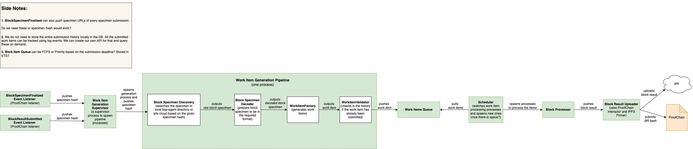

# Rudder

[](https://github.com/covalenthq/rudder/actions/workflows/docker-ci-test.yaml)
[](https://github.com/covalenthq/rudder/actions/workflows/compile-format.yaml)
[](https://github.com/covalenthq/rudder/actions/workflows/hadolint.yml)

Rudder is the rule engine processor and supervisor for the refiner process in the Covalent Network and further it scalably and securely captures block specimens and their respective transformations. Further information is included here in a [brief Refiner's Raison d'être](https://docs.google.com/document/d/1ps4HCRUwSPap98Q0lFYuyBVMN079o-s_K4yr7hh2Wws/edit?usp=sharing)



The happy path for `rudder` is made up of loosely coupled (some maintain state and some don't) actor processes spawned through gen server processes, that can be called upon to fulfill responsiblities at different sections in the refinement/transformation process - under one umberalla dynamic supervisor process, this can bring them back up in case of a failure to continue the operation.

## Install

Follow the internal workshop document - [Covalent Network Phase 2: Rudder (Refiner) Onboarding.](https://docs.google.com/document/d/1LzBHvNnuDNapBzNT4hLo554bWjj7edhWBlO_bMDVYtQ/edit?usp=sharing)

View and follow the internal workshop - [1st Refiner Workshop (07/02/2023).](https://covalent-hq.slack.com/files/U038D5LJ2S0/F04P6CA3XRN/gmt20230207-160648_recording_1920x1080.mp4)

If [available in Hex](https://hex.pm/docs/publish), the package can be installed
by adding `rudder` to your list of dependencies in `mix.exs`:

```elixir
  def deps do
    [
      {:rudder, "~> 0.1.2"}
    ]
  end
```

In order to run it in prod you need to add the operator private key inside `.envrc`:
```
export BLOCK_RESULT_OPERATOR_PRIVATE_KEY="put_your_key_here"
```

Documentation can be generated with [ExDoc](https://github.com/elixir-lang/ex_doc)
and published on [HexDocs](https://hexdocs.pm). Once published, the docs can
be found at <https://hexdocs.pm/rudder>.


## Run

Run all services including rudder in docker with the following -

```bash
docker compose --env-file ".env" -f "docker-compose-ci.yml" up --remove-orphans
```

By default this will perform and end to end test and create a release

### Pull

Pull only the latest containerized version of rudder using the following -

Make sure you're logged into gcr by running

```bash
gcloud auth print-access-token | docker login -u oauth2accesstoken --password-stdin https://gcr.io
```

Pull image

```docker
docker pull gcr.io/covalent-project/rudder:latest
```

### Environment Vars

Add the env vars to a .env file as below. Ask your node operator about these if you have questions.
Check the `.env_example` for the list of required (and optional) environment variables.

## Test

To start mock node, ProofChain, IPFS-Pinner and EVM server in Terminal 1 run:

```
docker compose --env-file '.env' -f 'docker-compose-support.yml' up --remove-orphans
```

Wait a minute then in Terminal 2 run:
```
mix test
```

## Block Specimen Transformer

1. Start application

  ```elixir
    iex -S mix

    Erlang/OTP 25 [erts-13.0] [source] [64-bit] [smp:8:8] [ds:8:8:10] [async-threads:1] [jit:ns] [dtrace]
    Generated rudder app
    Interactive Elixir (1.13.4) - press Ctrl+C to exit (type h() ENTER for help)

 iex(3)> Rudder.ProofChain.BlockSpecimenEventListener.start()
  ```

This should start listening to on-chain events for reward finalization of submitted block specimens. Once one such event is found, the block specimen will be fetched and processed in the pipeline.

3. You can tail the logs to check the state:
```bash
tail -f logs/log.log
17:52:11.222 file=lib/rudder/proof_chain/block_specimen_event_listener.ex line=100 [info] listening for events at 3707084
17:52:11.481 file=lib/rudder/proof_chain/block_specimen_event_listener.ex line=114 [info] found 0 bsps to process
17:52:11.742 file=lib/rudder/proof_chain/block_specimen_event_listener.ex line=125 [info] curr_block: 3707085 and latest_block_num:3769853
17:52:11.742 file=lib/rudder/proof_chain/block_specimen_event_listener.ex line=100 [info] listening for events at 3707085
17:52:12.001 file=lib/rudder/proof_chain/block_specimen_event_listener.ex line=114 [info] found 0 bsps to process
17:52:12.260 file=lib/rudder/proof_chain/block_specimen_event_listener.ex line=125 [info] curr_block: 3707086 and latest_block_num:3769853
17:52:12.261 file=lib/rudder/proof_chain/block_specimen_event_listener.ex line=100 [info] listening for events at 3707086
17:52:12.520 file=lib/rudder/proof_chain/block_specimen_event_listener.ex line=114 [info] found 0 bsps to process
17:52:12.913 file=lib/rudder/proof_chain/block_specimen_event_listener.ex line=125 [info] curr_block: 3707087 and latest_block_num:3769854
```

## Block Processor

The block processor takes block specimen, runs it through the stateless evm tool (server) and gives the block result. 

```elixir
iex(1)> Rudder.ProofChain.BlockSpecimenEventListener.push_bsps_to_process(["1_16582405_7f85dc42062468a6bbe420ae4fe4455b9c2423b798a6031f8ea7826997046907_402705672e34a250dcc798bb9ae3a14593e7cdc49750d57ef6018100503f3024"])
```

the corresponding logs:
```bash
17:56:38.124 file=lib/rudder/evm/block_processor.ex line=38 [info] submitting 16582405 to evm plugin...
17:56:39.028 file=lib/rudder/evm/block_processor.ex line=46 [info] writing block result into "/var/folders/w0/bf3y1c7d6ys15tq97ffk5qhw0000gn/T/briefly-1676/briefly-576460644194238825-5Hm1Jx2ZdSrq7sqPmEsC"
17:56:44.897 file=lib/rudder/block_result/block_result_uploader.ex line=41 [info] 16582405:402705672e34a250dcc798bb9ae3a14593e7cdc49750d57ef6018100503f3024 has been successfully uploaded at ipfs://bafybeif4mnjugrttv4ru337inkrkji4dwe755yphfpogitivuklvmp4cym
17:56:44.921 file=lib/rudder/block_result/block_result_uploader.ex line=47 [info] 16582405:402705672e34a250dcc798bb9ae3a14593e7cdc49750d57ef6018100503f3024 proof submitting
```


## Block Specimen Extractor (`Elixir` native)

1. In the above process we used a sync method to extract all the files in a given directory using a binary generated by Go code

2. Here we extract the files directly async by using a file stream, spawing a decode process for each file separately and using the AVRO library `avrora`

3. It is tested internally with the following steps ()
  a. reads a binary block specimen file
  b. starts the avro client
  c. decodes to json map using the `decode_plain` avrora fn
  d. streams the binary files (does it async - during stream execution)

```elixir

iex(4)> iex(3)> Rudder.Avro.BlockSpecimenDecoder.decode_file("test-data/1-15127599-replica-0x167a4a9380713f133aa55f251fd307bd88dfd9ad1f2087346e1b741ff47ba7f5")
[debug] reading schema `block-ethereum` from the file /Users/pranay/Documents/covalent/elixir-projects/rudder/priv/schemas/block-ethereum.avsc
{:ok,
 %{
   "codecVersion" => 0.2,
   "elements" => 1,
   "endBlock" => 15127599,
   "replicaEvent" => [
     %{
       "data" => %{
         "Hash" => "0x8f858356c48b270221814f8c1b2eb804a5fbd3ac7774b527f2fe0605be03fb37",
         "Header" => %{
           "baseFeePerGas" => 14761528828.0,
           "difficulty" => 1.1506847309002466e16,
           "extraData" => "SGl2ZW9uIHVzLWhlYXZ5",
           "gasLimit" => 29999972,
           ...
           ..
           .

```

4. Please note the above extractor process only extract a single specimen


```elixir

iex(6)> Rudder.Avro.BlockSpecimenDecoder.decode_dir("test-data/*")
[
  #Stream<[
    enum: ["test-data/1-15127599-replica-0x167a4a9380713f133aa55f251fd307bd88dfd9ad1f2087346e1b741ff47ba7f5"],
    funs: [#Function<47.127921642/1 in Stream.map/2>]
  ]>,
  #Stream<[
    enum: ["test-data/1-15127600-replica-0x14a2d5978dcde0e6988871c1a246bea31e44f73467f7c242f9cd19c30cd5f8b1"],
    funs: [#Function<47.127921642/1 in Stream.map/2>]
  ]>,
  #Stream<[
    enum: ["test-data/1-15127601-replica-0x4757d9272c0f4c5f961667d43265123d22d7459d63f2041866df2962758c6070"],
    funs: [#Function<47.127921642/1 in Stream.map/2>]
  ]>,
  #Stream<[
    enum: ["test-data/1-15127602-replica-0xce9ed851812286e05cd34684c9ce3836ea62ebbfc3764c8d8a131f0fd054ca35"],
    funs: [#Function<47.127921642/1 in Stream.map/2>]
  ]>,
  #Stream<[
    enum: ["test-data/1-15127603-replica-0x5fb7802a8b0f1853bd3e9e8a8646df603e6c57d8da7df62ed46bfec1a6a074c4"],
    funs: [#Function<47.127921642/1 in Stream.map/2>]
  ]>
]

```

5. A stream of specimens files can be passed instead to the avro decode process for lazy eval and further down the pipeline to the EBE (erigon t8n tool) processor

## Block Specimen Session Event Listener

In order to run the listener you need to fork ethereum node, run a script to add the operators and a script that mocks block specimen submissions and session finalizations using the docker:

1. Add `.env` file.

2. Inside `.env` add ERIGON_NODE variable and replace the node's url with yours:

```bash
export ERIGON_NODE="erigon.node.url"
```

3. Inside a terminal got to the rudder folder and run:

```bash
docker compose --env-file ".env" -f "docker-compose-local.yml" up --remove-orphans
```

4. Inside a separate terminal run:

```bash
docker exec -it eth-test-node /bin/sh  -c "cd /usr/src/app; npm run docker:run";
```

5. Inside a third terminal navigate to the `rudder` folder and run:

```elixir
iex -S mix
Rudder.ProofChain.BlockSpecimenEventListener.start()
```

## ProofChain Contract Interactor

In order to run the interactor you need to fork ethereum node and run a script to add the operators using the docker:

1. Add `.env` file.

2. Inside `.env` add ERIGON_NODE variable and replace the node's url with yours:

```bash
export ERIGON_NODE="erigon.node.url"
```

3. Inside a terminal got to the rudder folder and run:

```bash
docker compose --env-file ".env" -f "docker-compose-local.yml" up --remove-orphans
```

4. Inside a second terminal navigate to the `rudder` folder and run:

```elixir
iex -S mix
```

then

```elixir
Rudder.ProofChain.Interactor.test_submit_block_result_proof(block_height)
```

or

```elixir
Rudder.ProofChain.Interactor.submit_block_result_proof(chain_id, block_height, block_specimen_hash, block_result_hash, url)
=======
## Block Specimen Session Event Listener
In order to run the listener you need to fork ethereum node, run a script to add the operators and a script that mocks block specimen submissions and session finalizations:
1. Download [bsp-agent](https://github.com/covalenthq/bsp-agent).
2. Navigate to the `bsp-agent` folder.
3. Add `envrc.local ` file.
4. Inside `envrc.local` add ERIGON_NODE variable and replace the node's url with yours:

```
export ERIGON_NODE="erogone.node.url"
```
5. Inside a terminal got to the bsp-agent folder and run:
```
docker compose --env-file ".env" -f "docker-compose-local.yml" up --remove-orphans
```
6. Inside a separate terminal run:
```
docker exec -it eth-test-node /bin/sh  -c "cd /usr/src/app; npm run docker:run";
```
7. Inside a third terminal navigate to the `rudder` folder and run:
```
iex -S mix
Rudder.ProofChain.BlockSpecimenEventListener.start()
```


## Block Processor

The block processor (`lib/rudder/evm`) takes block_id and block specimen json string and gives the block result. The stateless EVM needed to do this is written in golang, which is invoked via Porcelain in elixir.

```elixir
iex(87)> replica_fp="test-data/1-15127602-replica-0xce9ed851812286e05cd34684c9ce3836ea62ebbfc3764c8d8a131f0fd054ca35"

iex(87)> [replica_fp] |> Stream.map(&Rudder.Avro.BlockSpecimenDecoder.decode_file/1) |> Enum.map(fn {:ok, contents} -> {Integer.to_string(Enum.random('0123456789abcdef')), Poison.encode!(contents)} end) |> Enum.map(&Rudder.BlockProcessor.sync_queue/1)

```

The gap above is that the `extractor` used for decoding is for codec version 0.2 and an older version of extractor which doesn't play with the stateless evm tool. Additionally, the specimen needs to be extracted from replica structure (json) before being passed to the `sync_queue` API.

## Journal
etfs library is used to implement a WAL journal for work items (block specimens) as they proceed through the pipeline. This might be useful for debugging purposes.

e.g. find all aborted work items
```bash
iex(2)> Rudder.Journal.items_with_status(:abort)
["1_16582405_7f85dc42062468a6bbe420ae4fe4455b9c2423b798a6031f8ea7826997046907_402705672e34a250dcc798bb9ae3a14593e7cdc49750d57ef6018100503f3024",
 "1_16582440_a73dbfde74b0d9b6cf070e4fedb6e625868f00ab58ac1166e912fe1d84b8b19c_c0f8c62fb4447c6957d4fafe5a8471d84a6ed65d18f54ec1a3f42d9c7e0674d2",
 "1_16582475_bd1ad41c4d8121825822c9c1741fd8d4edba23ff00c82c775306cbdf57811160_3164f2b7839582c8ff9fc0b117d5fb8e452181fb2b803b9eb021776f19b18408",
 "1_16582510_35f84d62560d271a7fa03cbbb1378e078f2fd4ec78cb1712e2cf060e53b00219_f73a943ec4b6707fb9299908d4a6ddad31311f534c58023380d164299b873755"]
```

---

## Troubleshooting

- permission errors with ~/.ipfs folder
In order to run IPFS-Pinner in your home directory you need to run:
```
sudo chmod -R 770 .ipfs
```