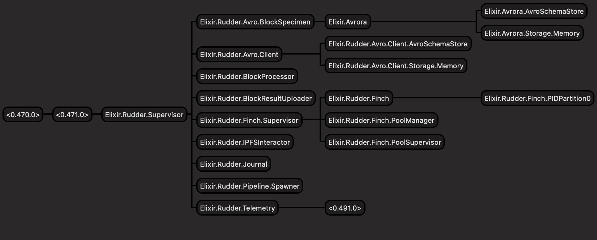

# <span id="rudder_arch">Architecture</span>

- [Architecture](#architecture)
  - [Block Specimen Event Listener](#block-specimen-event-listener)
  - [Block Specimen Decoder/Encoder](#block-specimen-encoder-decoder)
  - [Block Specimen Processor](#block-specimen-processor)
  - [Proof Chain Interactor](#proof-chain-interactor)
  - [Block Result Uploader](#block-result-uploader)
  - [IPFS Interactor](#ipfs-interactor)
  - [Pipeline Journal](#pipeline-journal)
  - [Pipeline Telemetry](#pipeline-telemetry)



The happy path for `rudder` (the refiner) application in the Covalent Network is made up of actor processes spawned through many [Gen Servers](https://elixir-lang.org/getting-started/mix-otp/genserver.html) processes that are loosely coupled, here some maintain state and some don't. The children processes can be called upon to fulfill responsibilities at different sections in the refinement/transformation process pipeline - under one umbrella [Dynamic Supervisor](https://elixir-lang.org/getting-started/mix-otp/dynamic-supervisor.html), that can bring them back up in case of a failure to continue a given pipeline operation.

There are currently 8 main components to the refiner.

  1. Block Specimen Event Listener
  2. Block Specimen Decoder/Encoder
  3. Block Specimen Processor
  4. Proof Chain Interactor
  5. Block Result Uploader
  6. IPFS Interactor
  7. Pipeline Journal
  8. Pipeline Telemetry


## <span id="rudder_arch_listen">Block Specimen Event Listener</span>

The block specimen event listener is the first to start in the rudder/refiner pipeline by listening to events happening in the [proof-chain contract](https://github.com/covalenthq/bsp-staking). The events refiner cares about relate to the finalized block specimens and the finalized block results.

For the former for all block specimen proofs that have been submitted and achieved consensus are ready for being transformed in block results.

Start the listener.

```elixir
iex -S mix

  Erlang/OTP 25 [erts-13.0] [source] [64-bit] [smp:8:8] [ds:8:8:10] [async-threads:1] [jit:ns] [dtrace]
    Generated rudder app
    Interactive Elixir (1.13.4) - press Ctrl+C to exit (type h() ENTER for help)

iex(1)> Rudder.ProofChain.BlockSpecimenEventListener.start()
```

This should start listening to on-chain events for reward finalization of submitted block specimens. Once one such event is found, the block specimen will be fetched and processed in the pipeline.

You can tail the logs to check the state:

```elixir
tail -f logs/log.log
17:52:11.222 file=lib/rudder/proof_chain/block_specimen_event_listener.ex line=100 [info] listening for events at 3707084
17:52:11.481 file=lib/rudder/proof_chain/block_specimen_event_listener.ex line=114 [info] found 0 bsps to process
17:52:11.742 file=lib/rudder/proof_chain/block_specimen_event_listener.ex line=125 [info] curr_block: 3707085 and latest_block_num:3769853
```

## <span id="rudder_arch_encode_decode">Block Specimen Encoder Decoder</span>

Once a block specimen that has been finalized has been received, rudder extracts the specimen directly async in the pipeline process, spawning a block specimen decode process for each specimen separately using AVRO client library `avrora`.

It carries out the following steps -
  
  1. Initializes the avro client.
  2. Reads a binary block specimen file.
  3. Decodes to json map using the `decode_plain` avrora fn.
  4. Streams the binary files (does it async - during stream execution).

```elixir
iex(1)> Rudder.Avro.BlockSpecimenDecoder.decode_file("test-data/1-15127599-replica-0x167a4a9380713f133aa55f251fd307bd88dfd9ad1f2087346e1b741ff47ba7f5")
[debug] reading schema `block-ethereum` from the file /Users/pranay/Documents/covalent/elixir-projects/rudder/priv/schemas/block-ethereum.avsc
{:ok,
 %{
   "codecVersion" => 0.2,
   "elements" => 1,
   "endBlock" => 15127599,
   "replicaEvent" => [
     %{
       "data" => %{
         "Hash" => "0x8f858356c48b270221814f8c1b2eb804a5fbd3ac7774b527f2fe0605be03fb37",
         "Header" => %{
           "baseFeePerGas" => 14761528828.0,
           "difficulty" => 1.1506847309002466e16,
           "extraData" => "SGl2ZW9uIHVzLWhlYXZ5",
           "gasLimit" => 29999972,
           ...
           ..
           .
```

**Note**: The above decoder process only decodes a single specimen. Here below we can extract an entire directory. A stream of specimens files can be passed instead to the avro decode process for lazy eval and further down the pipeline to the erigon evm t8n (transition) tool.

```elixir
iex(2)> Rudder.Avro.BlockSpecimenDecoder.decode_dir("test-data/*")
[
  #Stream<[
    enum: ["test-data/1-15127599-replica-0x167a4a9380713f133aa55f251fd307bd88dfd9ad1f2087346e1b741ff47ba7f5"],
    funs: [#Function<47.127921642/1 in Stream.map/2>]
  ]>,
  #Stream<[
    enum: ["test-data/1-15127600-replica-0x14a2d5978dcde0e6988871c1a246bea31e44f73467f7c242f9cd19c30cd5f8b1"],
    funs: [#Function<47.127921642/1 in Stream.map/2>]
  ]>,
  #Stream<[
    enum: ["test-data/1-15127601-replica-0x4757d9272c0f4c5f961667d43265123d22d7459d63f2041866df2962758c6070"],
    funs: [#Function<47.127921642/1 in Stream.map/2>]
  ]>
]
```

## <span id="rudder_arch_processor">Block Specimen Processor</span>

Next the block specimen processor available as an http server with `export EVM_SERVER_URL="http://127.0.0.1:3002"`. This takes the `block_id` and `block_specimen` json object and provides the block result. The stateless transition tool needed to run the specimen, is written in `golang`, which is invoked via the http server outside of rudder.

In an earlier version of rudder server the server was originally a (golang) binary plugin to the rudder application and executed with the block specimen inputs in a `:porcelain` app within a shell process in erlang, but then moved out due to performance and consistency considerations.

Below is an example of submitting a avro encoded block specimen binary to the specimen processor.

```elixir
iex(1)> replica_fp="test-data/1-15127602-replica-0xce9ed851812286e05cd34684c9ce3836ea62ebbfc3764c8d8a131f0fd054ca35"

iex(2)> [replica_fp] |> Stream.map(&Rudder.Avro.BlockSpecimenDecoder.decode_file/1) |> Enum.map(fn {:ok, contents} -> {Integer.to_string(Enum.random('0123456789abcdef')), Poison.encode!(contents)} end) |> Enum.map(&Rudder.BlockProcessor.sync_queue/1)

```

The block processor takes the block specimen, runs it through the stateless evm tool (server) and gives the block result. Another way by which we can achieve the transformation is by calling `push_bsps_to_process` from the event listener.

```elixir
iex(1)> Rudder.ProofChain.BlockSpecimenEventListener.push_bsps_to_process(["1_16582405_7f85dc42062468a6bbe420ae4fe4455b9c2423b798a6031f8ea7826997046907_402705672e34a250dcc798bb9ae3a14593e7cdc49750d57ef6018100503f3024"])
```

That will lead to the corresponding logs:

```elixir
17:56:38.124 file=lib/rudder/evm/block_processor.ex line=38 [info] submitting 16582405 to evm plugin...
17:56:39.028 file=lib/rudder/evm/block_processor.ex line=46 [info] writing block result into "/var/folders/w0/bf3y1c7d6ys15tq97ffk5qhw0000gn/T/briefly-1676/briefly-576460644194238825-5Hm1Jx2ZdSrq7sqPmEsC"
17:56:44.897 file=lib/rudder/block_result/block_result_uploader.ex line=41 [info] 16582405:402705672e34a250dcc798bb9ae3a14593e7cdc49750d57ef6018100503f3024 has been successfully uploaded at ipfs://bafybeif4mnjugrttv4ru337inkrkji4dwe755yphfpogitivuklvmp4cym
17:56:44.921 file=lib/rudder/block_result/block_result_uploader.ex line=47 [info] 16582405:402705672e34a250dcc798bb9ae3a14593e7cdc49750d57ef6018100503f3024 proof submitting
```

## <span id="rudder_arch_uploader">Block Result Uploader</span>

Once the block results have been produced they need to be proved and uploaded. This ideally happens atomically for rudder.

Below is an example of how to interact with block result uploader that speaks to `ipfs-pinner` available with `export IPFS_PINNER_URL="http://127.0.0.1:3000"`. The file is directly uploaded to IPFS using the wrapped local IPFS node.

```elixir
  file_path = Path.expand(Path.absname(Path.relative_to_cwd("test-data/temp2.txt")))

  expected_block_result_hash =
      <<44, 242, 77, 186, 95, 176, 163, 14, 38, 232, 59, 42, 197, 185, 226, 158, 27, 22, 30, 92,
        31, 167, 66, 94, 115, 4, 51, 98, 147, 139, 152, 36>>

  block_result_metadata = %Rudder.BlockResultMetadata{
      chain_id: 1,
      block_height: 1,
      block_specimen_hash: "525D191D6492F1E0928d4e816c29778c",
      file_path: file_path
    }

  {error, cid, block_result_hash} =
      Rudder.BlockResultUploader.upload_block_result(block_result_metadata)
```

That will lead to the corresponding logs:

```elixir
rudder        |   * test uploads block result to ipfs and sends the block result hash to proof chain [L#11]08:53:06.401 [info] Counter for ipfs_metrics - [pin: 1]
rudder        | 08:53:06.401 [info] LastValue for ipfs_metrics - [pin_last_exec_time: 7.41e-4]
rudder        | 08:53:06.402 [info] Sum for ipfs_metrics - [pin_total_exec_time: 7.41e-4]
rudder        | 08:53:06.402 [info] Summary for ipfs_metrics  - ***7.41e-4, 7.41e-4***
rudder        | 08:53:06.402 [info] 1:525D191D6492F1E0928d4e816c29778c has been successfully uploaded at ipfs://bafkreibm6jg3ux5qumhcn2b3flc3tyu6dmlb4xa7u5bf44yegnrjhc4yeq
rudder        | 08:53:06.414 [info] 1:525D191D6492F1E0928d4e816c29778c proof submitting
```

## <span id="rudder_arch_ipfs_interact">IPFS Interactor</span>

Underlying the block result uploader is the IPFS interactor module that allows refiner to interact with IPFS cids, by listening for them and uploading them. Below is an example to fetch or discover a block specimen using its uploaded `cid` collected by listening to the log event of a block specimen proof submission.

```elixir
iex(1)> urls=["ipfs://bafybeifo5o7zatnudfyvixkziy5aj4fhikv5nq3pbizpgwdcz4fqwarhgu"]
iex(2)> {:ok, specimen} = Rudder.IPFSInteractor.discover_block_specimen(urls)
[info] Counter for ipfs_metrics - [fetch: 1]
[info] LastValue for ipfs_metrics - [fetch_last_exec_time: 0.0026019999999999997]
[info] Sum for ipfs_metrics - [fetch_total_exec_time: 0.0026019999999999997]
[info] Summary for ipfs_metrics  - {0.0026019999999999997, 0.0026019999999999997}
{:ok,
 <<2, 132, 1, 48, 120, 57, 99, 102, 56, 102, 49, 50, 54, 57, 99, 99, 51, 49, 57,
   56, 48, 54, 97, 56, 48, 102, 101, 101, 100, 51, 57, 100, 54, 57, 51, 99, 102,
   54, 56, 99, 54, 56, 49, 52, 98, 98, 50, 53, ...>>}
```

Thereafter we can decode this block specimen and continue to use it in the pipeline process as seen before.

```elixir
iex(3)> {:ok, decoded_specimen} = Rudder.Avro.BlockSpecimen.decode(specimen)
[debug] reading schema `block-ethereum` from the file /Users/pranay/Documents/covalent/elixir-projects/rudder/priv/schemas/block-ethereum.avsc
{:ok,
 %{
   "codecVersion" => 0.32,
   "elements" => 1,
   "endBlock" => 16918710,
   "replicaEvent" => [
     %{
       "data" => %{
         "Hash" => "0x9cf8f1269cc319806a80feed39d693cf68c6814bb2509458d719756657bdc15c",
         "Header" => %{
           "baseFeePerGas" => "0x53e1e16d0",
           "difficulty" => "0x0",
           "extraData" => "QGJ1aWxkZXIweDY5",
           "gasLimit" => 30000000,
           "gasUsed" => 17841359,
```

## <span id="rudder_arch_proof_chain">Proof Chain Interactor</span>

Many operators submit block results and their respective proofs for consensus to the proof-chain smart contract mentioned earlier. This function can be called below as follows.

```elixir
Rudder.ProofChain.Interactor.submit_block_result_proof(chain_id, block_height, block_specimen_hash, block_result_hash, url)
```

That will lead to the corresponding logs:

```elixir
rudder        | 08:53:11.689 [info] 16792500:cd218d31ed5b606dae5076d01b649d849746a84735cf0f8481ad34553ee2b4b4 proof submitting
hardhat-node  | eth_getBlockByNumber
hardhat-node  | eth_estimateGas
hardhat-node  | eth_getTransactionCount
hardhat-node  | eth_gasPrice
hardhat-node  | eth_sendRawTransaction
hardhat-node  |   Contract call:       <UnrecognizedContract>
hardhat-node  |   Transaction:         0x5ccb44793604049c91f592cf9854f78004ac0e63c3f6e2acb8c55fa64856894f
hardhat-node  |   From:                0x9965507d1a55bcc2695c58ba16fb37d819b0a4dc
hardhat-node  |   To:                  0xcf3d5540525d191d6492f1e0928d4e816c29778c
hardhat-node  |   Value:               0 ETH
hardhat-node  |   Gas used:            349532 of 354993
hardhat-node  |   Block #13182330:     0x663cf0a29213261d40c5665a48ae0c670d9d6362102c094a0298f5eddcf91ce5
hardhat-node  | 
rudder        | 08:53:11.879 [info] Counter for brp_metrics - [proof: 3]
rudder        | 08:53:11.879 [info] LastValue for brp_metrics - [proof_last_exec_time: 1.9099999999999998e-4]
rudder        | 08:53:11.880 [info] Sum for brp_metrics - [proof_total_exec_time: 5.579999999999999e-4]
rudder        | 08:53:11.880 [info] Summary for brp_metrics  - ***1.7999999999999998e-4, 1.9099999999999998e-4***
rudder        | 08:53:11.880 [info] 16792500 txid is 0x5ccb44793604049c91f592cf9854f78004ac0e63c3f6e2acb8c55fa64856894f
```

## <span id="rudder_arch_journal">Pipeline Journal</span>

The Etfs library is used to implement a Write-Ahead Logging (WAL) journal for queued work items (block specimens) as they proceed through the transformer pipeline. This is useful for debugging purposes.

To find all aborted work items.

```bash
iex(2)> Rudder.Journal.items_with_status(:abort)
["1_16582405_7f85dc42062468a6bbe420ae4fe4455b9c2423b798a6031f8ea7826997046907_402705672e34a250dcc798bb9ae3a14593e7cdc49750d57ef6018100503f3024",
 "1_16582440_a73dbfde74b0d9b6cf070e4fedb6e625868f00ab58ac1166e912fe1d84b8b19c_c0f8c62fb4447c6957d4fafe5a8471d84a6ed65d18f54ec1a3f42d9c7e0674d2",
 "1_16582475_bd1ad41c4d8121825822c9c1741fd8d4edba23ff00c82c775306cbdf57811160_3164f2b7839582c8ff9fc0b117d5fb8e452181fb2b803b9eb021776f19b18408",
 "1_16582510_35f84d62560d271a7fa03cbbb1378e078f2fd4ec78cb1712e2cf060e53b00219_f73a943ec4b6707fb9299908d4a6ddad31311f534c58023380d164299b873755"]
```

Rudder keeps track of all the queue items that are in the following states of processing - `:discover`, `:commit`, `:abort`, `:skip` and tries to reprocess them from when it left off.

## <span id="rudder_arch_journal">Pipeline Telemetry</span>

Rudder records various metrics like `counter`, `lastvalue`, `sum` and `summary` during a pipeline process within each module and stores them in an ETF table by modules. This can then be used to understand how the processes have been progressing and where the performance bottlenecks may lay.

The logs that pertain to the telemetry and performance of rudder can be seen as follows from fetching start (specimen event) to finish (pipeline success).

```elixir
rudder       | [info] starting event listener
rudder       | [info] listening for events at 4168403
rudder       | [info] found 0 bsps to process
rudder       | [info] curr_block: 4168408 and latest_block_num:4168408
rudder       | [info] listening for events at 4168408
rudder       | [info] found 1 bsps to process
ipfs-pinner  | 2023/04/17 22:12:49 unixfsApi.Get: getting the cid: bafybeigx7gwkso5iwikf3f2tv2jfgri5naipxavjntejrc24bfusxn6xju
ipfs-pinner  | 2023/04/17 22:12:49 trying out https://w3s.link/ipfs/bafybeigx7gwkso5iwikf3f2tv2jfgri5naipxavjntejrc24bfusxn6xju
rudder       | [info] Counter for ipfs_metrics - [fetch: 1]
rudder       | [info] LastValue for ipfs_metrics - [fetch_last_exec_time: 0.001508]
rudder       | [info] Sum for ipfs_metrics - [fetch_total_exec_time: 0.001508]
rudder       | [info] Summary for ipfs_metrics  - {0.001508, 0.001508}
rudder       | [debug] reading schema `block-ethereum` from the file /app/priv/schemas/block-ethereum.avsc
rudder       | [info] Counter for bsp_metrics - [decode: 1]
rudder       | [info] LastValue for bsp_metrics - [decode_last_exec_time: 0.0]
rudder       | [info] Sum for bsp_metrics - [decode_total_exec_time: 0.0]
rudder       | [info] Summary for bsp_metrics  - {0.0, 0.0}
rudder       | [info] submitting 17069220 to evm http server...
evm-server   | [INFO] [04-17|22:12:51.380] input file at                            loc=/tmp/30064047
evm-server   | [INFO] [04-17|22:12:51.389] output file at:                          loc=/tmp/3478340040
evm-server   | [INFO] [04-17|22:12:51.659] Wrote file                               file=/tmp/3478340040
rudder       | [info] writing block result into "/tmp/briefly-1681/briefly-576460687785480033-OJ3w3e15QdqaGb0t5Z"
rudder       | [info] Counter for bsp_metrics - [execute: 1]
rudder       | [info] LastValue for bsp_metrics - [execute_last_exec_time: 3.39e-4]
rudder       | [info] Sum for bsp_metrics - [execute_total_exec_time: 3.39e-4]
rudder       | [info] Summary for bsp_metrics  - {3.39e-4, 3.39e-4}
ipfs-pinner  | 2023/04/17 22:12:51 generated dag has root cid: bafybeihcj2gkfx4zeilbssby4brs22nnncnkc3wy4vopw3vo7qe5re6tqm
ipfs-pinner  | 2023/04/17 22:12:51 car file location: /tmp/3248414975.car
ipfs-pinner  | 2023/04/17 22:12:52 uploaded file has root cid: bafybeihcj2gkfx4zeilbssby4brs22nnncnkc3wy4vopw3vo7qe5re6tqm
rudder       | [info] Counter for ipfs_metrics - [pin: 1]
rudder       | [info] LastValue for ipfs_metrics - [pin_last_exec_time: 0.001248]
rudder       | [info] Sum for ipfs_metrics - [pin_total_exec_time: 0.001248]
rudder       | [info] Summary for ipfs_metrics  - {0.001248, 0.001248}
rudder       | [info] 17069220:bc86fcbda627565085932b83c91fa3a9638fe660917c6f96742676dd9b967835 has been successfully uploaded at ipfs://bafybe>
rudder       | [info] 17069220:bc86fcbda627565085932b83c91fa3a9638fe660917c6f96742676dd9b967835 proof submitting
rudder       | [info] Counter for brp_metrics - [proof: 1]
rudder       | [info] LastValue for brp_metrics - [proof_last_exec_time: 3.1e-4]
rudder       | [info] Sum for brp_metrics - [proof_total_exec_time: 3.1e-4]
rudder       | [info] Summary for brp_metrics  - {3.1e-4, 3.1e-4}
rudder       | [info] 17069220 txid is 0x0ec13417b62262cc0fff47653d678af8aba082acfc14de364486103180677f3c
rudder       | [info] Counter for brp_metrics - [upload_success: 1]
rudder       | [info] LastValue for brp_metrics - [upload_success_last_exec_time: 0.001581]
rudder       | [info] Sum for brp_metrics - [upload_success_total_exec_time: 0.001581]
rudder       | [info] Summary for brp_metrics  - {0.001581, 0.001581}
rudder       | [info] Counter for rudder_metrics - [pipeline_success: 1]
rudder       | [info] LastValue for rudder_metrics - [pipeline_success_last_exec_time: 0.0036019999999999997]
rudder       | [info] Sum for rudder_metrics - [pipeline_success_total_exec_time: 0.0036019999999999997]
rudder       | [info] Summary for rudder_metrics  - {0.0036019999999999997, 0.0036019999999999997}
rudder       | [info] curr_block: 4168409 and latest_block_num:4168408
```
